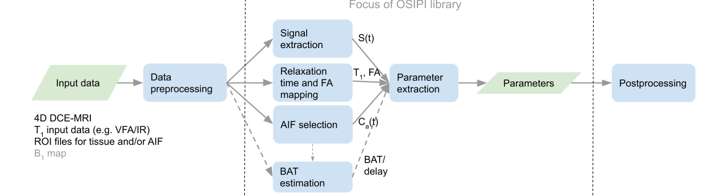

# Scientific design specification for DC pipelines

## Purpose

The purpose of this document is to specify the scientific requirements for the DC OSIPI code library. This includes the targeted functionality and minimal processing pipeline described in TF2.3 Scope Document as well as planning for future extension of library functionality.

The aim is to describe the scientific requirements in sufficient detail such that TF2.1 can produce a detailed library structure and code stubs in specific languages using appropriate software design patterns. 

## Data Format

Modules will be able to accept, process and/or generate both voxel data (i.e. 2-3 spatial dimensions) and ROI data (i.e. one or more parameter values or dynamic time series).

Modules will not necessarily be tied to a specific imaging format. Instead, data will be input and returned to/from modules as variables, objects and/or as using a general i/o format that works with several software languages, such that it is potentially possible to switch between software languages within the pipeline, for example HDF5 ([https://www.hdfgroup.org/solutions/hdf5/](https://www.hdfgroup.org/solutions/hdf5/)). This should be decided in collaboration with TF 2.1.

The library will provide functionality to read input data from files, and to write intermediate and final outputs to files. For image data, the library will provide functionality to read and write in DICOM and NIfTI formats. ROIs will be defined as mask images using the same data format.

## Scope of OSIPI library version 1.0

The next paragraphs present an overview of the pipelines that we would like to target in the OSIPI library. The scope of the DC library will be on the data processing and parameter extraction. Initial preprocessing (e.g. spatial realignment, smoothing) and  postprocessing (e.g. export images to DICOM, parameter statistics) will be considered outside the scope of the library for now. To be more specific, the pipeline requires that all image data is registered (within DCE/DSC and with B1 map, T1 map, ROI masks etc.) and that all input images and ROIs are available in an OSIPI-compatible data format (e.g. NIfTI/DICOM for image data). 

The minimal aim of the first version of the library is to have functionality to build a basic pipeline for DSC and DCE analysis (see scope document of first milestone). However, we aim to  specify the pipelines in such a way that future extensions with more diverse or advanced analysis steps will be possible without modifying the library structure. The pipelines for DCE and DSC are specified separately, although some of the functionality is similar. For terminology and parameter names the preliminary version of TF4.2 DC lexicon was used.

## DCE-MRI Pipeline Overview

Fig. 1 shows a high-level overview of the DCE pipeline(s) that we aim to target in the OSIPI library version 1.0. The following input data are required and will be converted to native OSIPI objects/variables/files as the first step:

* N-D S(t) image data and acquisition parameters
* T1 input image data and acquisition parameters
* FA correction factor image data (optional)
* ROI mask images (optional)
* AIF mask images (optional)

_Fig. 1	High-level overview of DCE pipeline with data in green boxes and processing steps in blue. Dotted lines indicate optional functionality depending on the exact choice of data analysis. Abbreviations: AIF = arterial input function; BAT = bolus arrival time._

The following paragraphs describe parts of the pipeline in more detail.

### Signal extraction

This part describes the preprocessing of the N-D S(t) data. Here a choice will be made whether the data will be analysed as an image (2-3 spatial dimensions) or as multiple ROI time series (2D, i.e. ROI index + time). In case of ROI analysis, average time curves will be determined from all of the voxels in each ROI. As a result, other outputs in the pipeline, like T1 and BAT, should also be vectors of length NROI.

_Fig. 2 Signal extraction flow chart_

### Relaxation time mapping

Provide code to convert source images to T1 maps (or T1 values in the case of ROI analysis) in OSIPI format. Input images are assumed to be in DCE-MRI space [may not always be optimal]. Library v1.0 will target the variable flip angle method, but include scope to accommodate other methods later.

 

_Fig. 3 Relaxation time mapping flow chart_

### BAT estimation

Provide code to extract the bolus arrival time (i.e. time of arrival of contrast agent in tissue of interest) or delay time (i.e. time difference between arrival of contrast agent in the AIF and tissue of interest). In case of ROI analysis, the signal intensity data in the ROI should be averaged. Depending on the method, the input data may be the raw signal intensity data, the concentration data and/or relative signal enhancement data.

_Fig. 4 BAT estimation flow chart_

### AIF selection

We assume initially that an AIF ROI mask will be provided as input or that a population AIF will be used. In future the library may include the capability to generate one or more AIFs from the data automatically. The postprocessing box in case of direct measurement could involve steps as fitting a model to the concentration time curve. 

_Fig. 5 AIF selection flow chart_

The library will also accommodate the reference region (RR) method. In this case, the input of the model is not Ca(t) but CRR(t). CRR(t) will be determined in a similar way as the direct measurement of the AIF where instead of an AIF mask, a mask of the reference region is provided (either manual or automatic). 

### Parameter extraction

The input and output data for this step can be either images or values, depending on whether image or ROI analysis was chosen, stored as native OSIPI objects/variables/files. The library will support derivation of parameters based on time-concentration data (classical approach), relative enhancement, and by fitting a forward model of the signal.

V1.0 of the library will aim to support simple, common pharmacokinetic models (e.g. Tofts, extended Tofts, Patlak 2CXM etc.) under the assumption of fast water exchange. However, the library design should be sufficiently flexible to accommodate other approaches such as slow-intermediate water exchange with fixed or floating water exchange parameters, reference region methods and descriptive analysis (AUC, slope, TTP etc.). There will be flexibility (where possible) to use different fitting approaches, e.g. NLLS, linear, Bayesian etc.

The S_to_C processing box describes the conversion from signal S(t) to concentration C(t) for which both linear and nonlinear conversions can be used. The classical approach uses a measured T1 value, but the library should also allow for implementation of the bookend technique for example. 

_Fig. 6 Parameter extraction flow chart. Various inputs from previous processing steps are required. Abbreviations: Ca(t) = arterial input function, BAT = bolus arrival time, Hct = Hematocrit correction factor, FA = flip angle, ASE = absolute signal enhancement, RSE = relative signal enhancement, RR = reference method_

A more detailed example of the modelling part in the parameter derivation box is shown in the figure below. 

_Fig. 7 Example of the modelling part in the parameter derivation box that results in the modelled C(t) or modelled S(t) that is used in the optimization._

## DSC-MRI Pipeline

The diagrams below outline the DSC pipeline that we will target in the OSIPI library version 1.0. The following input data are required and will be converted to native OSIPI objects/variables/files as the first step:

* 4D S(t) image data and acquisition parameters
* ROI mask images (optional)
* AIF mask images (optional)

_Fig. 8 High-level overview of DSC processing pipeline. Data in green boxes, processing steps in blue. Dotted lines indicate optional functionality depending on the exact choice of data analysis. Abbreviations; AIF = arterial input function;: BAT = bolus-arrival time; WBNE = whole-brain non-enhancing region_
